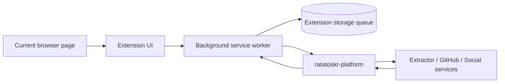
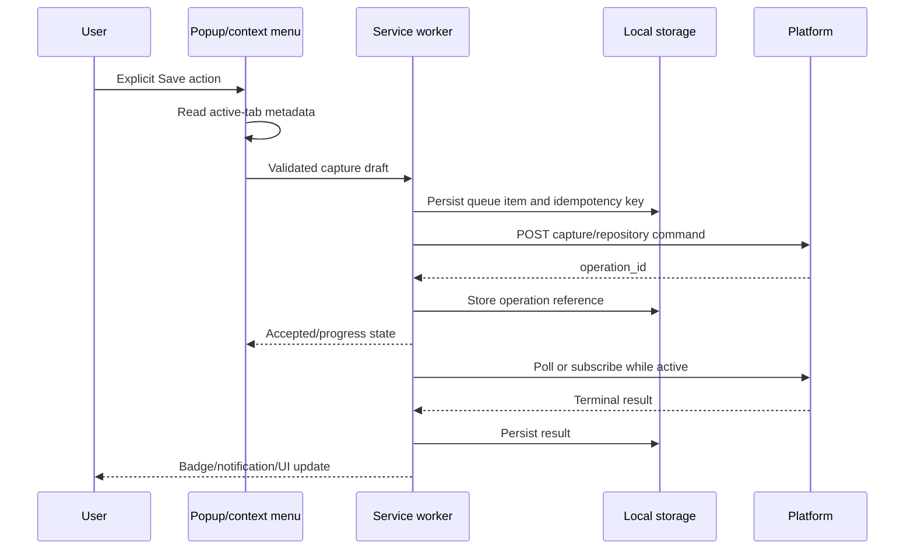
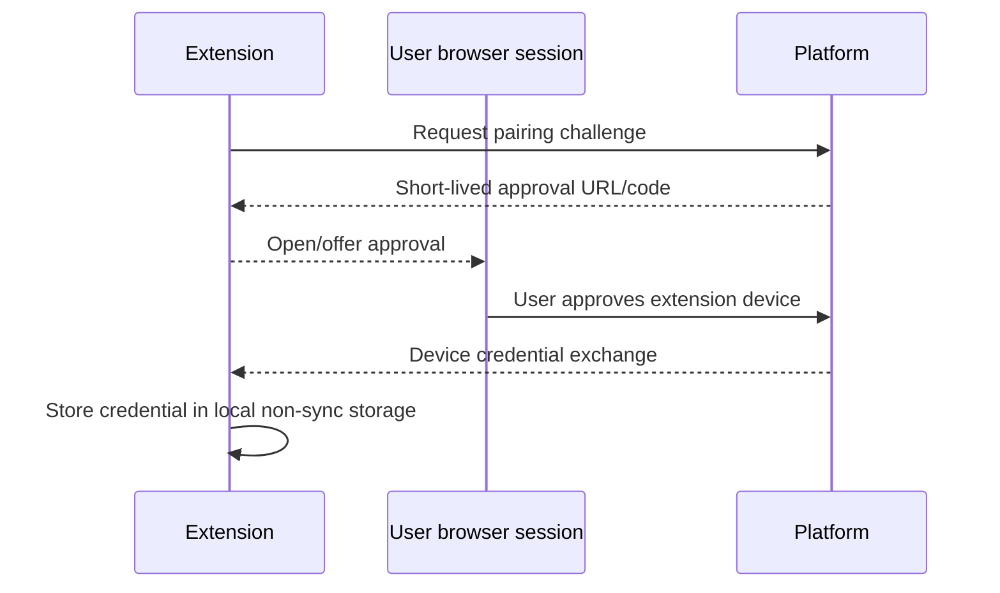

# Ratatoskr Browser Extension Architecture

> Status: target architecture. This repository is in architecture bootstrap; the document defines the intended browser-extension components, capture flow, permissions, persistence, and security boundaries.

## 1. Purpose

`ratatoskr-browser-extension` gives the user an explicit, low-friction way to save the current page, link, selected text, social publication, or GitHub repository into Ratatoskr.

It is responsible for:

- user-triggered capture from supported browser surfaces;
- minimal page metadata and selected-text collection;
- source/platform classification;
- local note, collection, tag, and repository-mode selection;
- registered-device authentication to Platform;
- durable offline/retry queue compatible with Manifest V3 lifecycle;
- operation progress and result presentation;
- optional context-menu and keyboard-shortcut entrypoints.

It is not a browsing-history collector, cookie extractor, provider-session connector, hidden-API interceptor, article scraper, or LLM client.

## 2. Architectural position



The extension sends explicit capture intent to Platform. Owning services resolve provider content and perform long-running work.

## 3. Repository structure

```text
ratatoskr-browser-extension/
├── src/
│   ├── background/
│   ├── popup/
│   ├── options/
│   ├── content/
│   ├── shared/
│   │   ├── domain/
│   │   ├── api/
│   │   ├── auth/
│   │   ├── queue/
│   │   ├── storage/
│   │   └── telemetry/
│   └── platform/
│       ├── chromium/
│       └── firefox/
├── tests/
│   ├── unit/
│   ├── integration/
│   └── e2e/
├── manifests/
├── scripts/
├── docs/
└── package configuration
```

UI framework and bundler may evolve, but capture domain, queue, API client, and browser-specific adapters remain separated.

## 4. Runtime components

### 4.1. Popup or side panel

The primary UI:

- reads current tab metadata after explicit user action;
- shows classified capture type;
- accepts note, tags, collection, and provider-specific options;
- requests confirmation for external writes;
- submits a local queue item;
- shows recent operation status.

### 4.2. Background service worker

The service worker owns:

- message validation;
- device auth and API client;
- durable queue orchestration;
- retry/backoff;
- context-menu and command handling;
- operation polling/notification;
- browser action badge state;
- migration of extension-local storage.

No workflow relies on the worker staying alive continuously.

### 4.3. Content script

A content script is optional and narrowly scoped. It may collect:

- canonical URL candidate;
- document title;
- selected text explicitly requested by the user;
- basic Open Graph/metadata fields;
- page language;
- provider object URL hints.

It must not:

- read cookies or local storage;
- intercept network requests;
- inspect password/payment fields;
- scrape the full DOM by default;
- monitor navigation in the background;
- transmit data before explicit capture.

### 4.4. Options page

The options UI manages:

- Ratatoskr server pairing;
- device status/revocation;
- default collection/tag behavior;
- capture and notification preferences;
- allowed optional host permissions;
- queue diagnostics and retry;
- privacy settings.

## 5. Permission architecture

The extension starts with the minimum permissions necessary for explicit capture.

Preferred permission families:

```text
activeTab
storage
contextMenus, when enabled
commands, when enabled
notifications, when enabled
```

Host access is limited to the configured Ratatoskr origin. Optional provider host permissions are requested only when a documented feature requires them and does not rely on session extraction.

Broad `<all_urls>` permission is avoided. `activeTab` provides temporary page access after a user gesture.

Permission changes are treated as product/security changes and require review.

## 6. Capture types

### 6.1. Page/article capture

Payload:

```text
original URL
canonical URL candidate
title
selected text, when explicitly requested
page language
capture timestamp
optional note/collection/tags
```

Platform routes the URL to Extractor or a provider service. The extension does not fetch or parse the full article.

### 6.2. Social capture

For X, Instagram, or Threads URLs, the extension sends:

- provider classification;
- canonical URL candidate;
- explicit user capture time;
- optional selected text/note;
- acquisition source = BrowserExtension.

It does not read native bookmark lists or provider sessions. X authoritative bookmark synchronization remains in `ratatoskr-x`; Instagram/Threads captures remain explicit non-authoritative saves.

### 6.3. GitHub repository capture

For repository URLs, the UI offers:

```text
metadata
track
star
```

- `metadata` stores catalog metadata only;
- `track` requests backup policy without starring;
- `star` requests a provider mutation and requires explicit confirmation/write consent.

The extension never receives the GitHub token and never calls GitHub with server credentials.

### 6.4. Selected-text note

A user may save selected text as a note with source URL and page metadata. The payload is size-limited and labelled as user-selected page content, not authoritative article extraction.

### 6.5. Link context-menu capture

The context menu can capture a link target without navigating. It records both target URL and source-page URL for provenance.

## 7. Capture flow



The UI can close immediately after the queue item is durable.

## 8. Capture payload minimization

The extension sends only what is required:

- explicit URL and classification;
- selected metadata fields;
- user-entered note/tags/collection IDs;
- selected text only when intentionally captured;
- client/device and idempotency metadata.

It does not send:

- all page HTML;
- browsing history;
- cookies/local storage;
- hidden form values;
- unrelated DOM text;
- provider API responses;
- screenshots unless the user invokes an explicit future feature.

Payload sizes and field lengths are bounded before persistence and upload.

## 9. URL and input handling

URLs and page metadata are hostile input.

Controls:

- support HTTP/HTTPS and explicitly allowed Ratatoskr deep links only;
- reject `javascript:`, `data:`, `file:`, browser-internal, and extension URLs;
- preserve original and normalized URL separately;
- never execute or inject captured text as HTML;
- truncate title/selection/note under explicit limits;
- normalize Unicode safely;
- treat page-provided canonical URLs as candidates;
- validate messages between content scripts, UI, and service worker.

## 10. Local queue architecture

Manifest V3 service workers are ephemeral, so queue state is durable.

Suggested entities:

```text
capture_drafts
queue_items
attempts
operation_refs
recent_results
device_state
settings
schema_version
```

### 10.1. Queue item state

```text
draft
-> queued
-> submitting
-> accepted
-> tracking
-> completed
```

Alternative states:

```text
retry_wait
paused
auth_required
needs_confirmation
failed_permanent
cancelled
```

Every transition is persisted before asynchronous continuation.

### 10.2. Idempotency

The extension creates a UUID idempotency key per intentional capture. Retrying the same item reuses it. Editing a queued draft creates a new request fingerprint/key when semantics change.

### 10.3. Storage choice

Small queue metadata uses browser extension storage or IndexedDB through an abstraction. Large captured content is not supported by default. Sensitive device credentials use the browser/platform-appropriate secure pattern and are never synced through cross-device browser sync storage.

## 11. Device authentication

The extension pairs with Platform as a registered device.



Rules:

- credential is scoped to one Ratatoskr origin and device;
- tokens are rotatable/revocable;
- server origin changes require explicit re-pairing;
- no credential in logs, synced settings, URL query strings, or page context;
- content scripts never receive device credentials;
- API calls are made only by the service worker/shared privileged layer.

## 12. Platform API architecture

Representative calls:

```text
POST /v2/devices/pair
POST /v2/captures
POST /v2/github/repositories
GET  /v2/operations/{id}
GET  /v2/capabilities
```

The extension uses public contracts from `ratatoskr-contracts` and does not call internal provider services directly.

Capability discovery controls which UI actions are offered. A missing capability disables the feature rather than guessing internal topology.

## 13. External-write confirmations

Actions such as GitHub `star` or future provider write-back require:

1. explicit action selection;
2. clear description of the external effect;
3. owning account/connection indication;
4. confirmation immediately before submission;
5. separate operation result for provider mutation and downstream work.

No default or remembered setting silently upgrades `metadata`/`track` into `star`.

## 14. Operation tracking

The extension stores the `operation_id` and bounded status/result.

Tracking options:

- poll while popup/side panel is open;
- scheduled/background retry checks;
- optional SSE only while a durable browser context supports it;
- notification and badge on terminal state.

The extension does not depend on a persistent connection.

Partial results are displayed explicitly, for example:

```text
Repository metadata added
GitHub star succeeded
Backup enrollment failed and can be retried
```

## 15. Notifications and badge

Optional notifications:

- capture accepted/completed;
- capture failed with action required;
- external mutation partial result;
- queued items need reauthentication.

Badge states remain coarse and privacy-preserving. They never display source titles or private text.

## 16. Browser abstraction

Browser-specific APIs are isolated behind adapters:

```text
tabs/activeTab
context menus
commands
notifications
storage
identity/pairing launch
side panel or popup differences
```

Core queue and capture logic is browser-neutral. Build outputs can target Chromium MV3 and Firefox-compatible manifests when supported.

## 17. Content Security Policy and rendering

- no remote executable code;
- no `eval` or dynamic script construction;
- strict extension CSP;
- captured text rendered as escaped text/Markdown through a safe renderer;
- external links opened with safe target/rel behavior;
- no provider embed HTML inserted into extension pages without sanitization;
- dependencies bundled and pinned;
- source maps and diagnostics reviewed for secret leakage.

## 18. Supply-chain architecture

- lockfile committed;
- dependency updates reviewed and automated under policy;
- minimal third-party libraries in privileged background/content paths;
- reproducible builds where practical;
- package integrity and license checks;
- generated API types tracked to contract versions;
- store packages built from tagged commits;
- signing keys/store credentials remain outside the repository and CI logs.

## 19. Privacy architecture

- no passive browsing collection;
- no history permission by default;
- no cookies, local storage, password fields, or network interception;
- user gesture required for capture;
- local queue stores minimum metadata;
- notes/selections excluded from logs and metrics;
- server telemetry is bounded and optional;
- diagnostics are sanitized;
- clear UI indicates what will be sent before submission;
- uninstall/revoke guidance removes the registered device token.

## 20. Failure model

### Transient

- browser worker suspended;
- network unavailable;
- Platform timeout/throttling;
- temporary storage failure;
- operation tracking interrupted.

### Action-required

- device credential revoked;
- server origin/certificate changed;
- permission removed;
- external write consent missing;
- capture type unsupported by server capabilities.

### Permanent for one item

- invalid/blocked URL scheme;
- payload exceeds limits;
- page context disappeared before capture;
- server rejects malformed request.

Queue state preserves the item and retry/action information.

## 21. Security boundaries

- No provider cookies, passwords, tokens, hidden API traffic, or browser-session export.
- No passive page/background monitoring.
- Content scripts are untrusted relative to the privileged service worker.
- Every cross-context message is schema-validated and sender-checked.
- Device credentials never enter page/content-script context.
- URLs and selected text are hostile data.
- API calls target only the explicitly paired HTTPS origin.
- Redirects cannot silently send credentials to another origin.
- External provider writes require confirmation.
- Extension storage sync is not used for secrets.
- Logs and crash reports exclude captured content and credentials.

## 22. Observability and diagnostics

Local counters:

```text
captures_created
captures_by_type
queue_depth
submission_duration
submission_retries
operation_age
completed/partial/failed results
auth_required events
storage migration failures
content-script validation failures
```

No raw URL, title, selection, note, provider handle, or token is used as a metric label. Diagnostics can export sanitized queue state and version information.

## 23. Testing architecture

### Unit

- URL/type classification;
- payload minimization and limits;
- queue state transitions;
- idempotency;
- retry/backoff;
- capability-driven UI;
- external-write confirmation rules;
- message validators.

### Integration

- background worker restart/suspension;
- storage migrations;
- device pairing and revocation;
- offline queue and retry;
- Platform API error mapping;
- operation tracking and partial results;
- browser adapter behavior.

### Security

- content script cannot obtain credentials;
- malicious page messages rejected;
- unsafe URL schemes rejected;
- captured HTML escaped;
- CSP and no remote code checks;
- host permission regression checks;
- no cookies/history APIs used.

### End-to-end

Using Playwright or browser-extension harness:

- capture ordinary article;
- capture selected text;
- capture Instagram/Threads post with explicit provenance;
- add GitHub repository in metadata/track/star modes;
- close popup before upload and verify queue completion;
- revoke device and recover through pairing;
- show terminal operation result.

## 24. Build and release architecture

Build pipeline:

```text
typecheck
-> lint and unit tests
-> contract generation check
-> build browser variants
-> manifest permission audit
-> extension E2E tests
-> package deterministic artifacts
-> sign/publish through protected release workflow
```

Browser-store metadata and privacy disclosures must match actual permissions and behavior.

## 25. Architectural invariants

1. Capture is always initiated by an explicit user action.
2. Permissions are minimal and reviewed.
3. The extension never reads provider cookies, passwords, hidden APIs, or browsing history.
4. Capture payloads contain only required user-visible data.
5. Content scripts never receive device credentials.
6. Queue state survives service-worker suspension.
7. Retries reuse idempotency keys.
8. Platform is the only server API boundary.
9. Provider services own resolution and synchronization.
10. Instagram/Threads captures remain explicit non-authoritative saves.
11. GitHub external writes require explicit confirmation.
12. Captured text and URLs are hostile data.
13. No remote executable code is loaded.
14. Logs and metrics exclude user content and secrets.

## 26. Evolution

Initial milestones:

1. MV3 shell, popup, active-tab metadata, and URL capture.
2. Platform device pairing and typed API client.
3. Durable queue and offline retry.
4. Article/social routing and operation results.
5. GitHub metadata/track/star modes with confirmation.
6. Selected-text and link context-menu capture.
7. Notifications, badge, and options diagnostics.
8. Firefox/browser abstraction.
9. Store packaging, permission/privacy audit, and release automation.
10. Optional side-panel workflow and richer organization UI.

Changes to permissions, provider-session policy, passive collection, credential storage, or external-write defaults require ADRs and coordinated workspace changesets.
